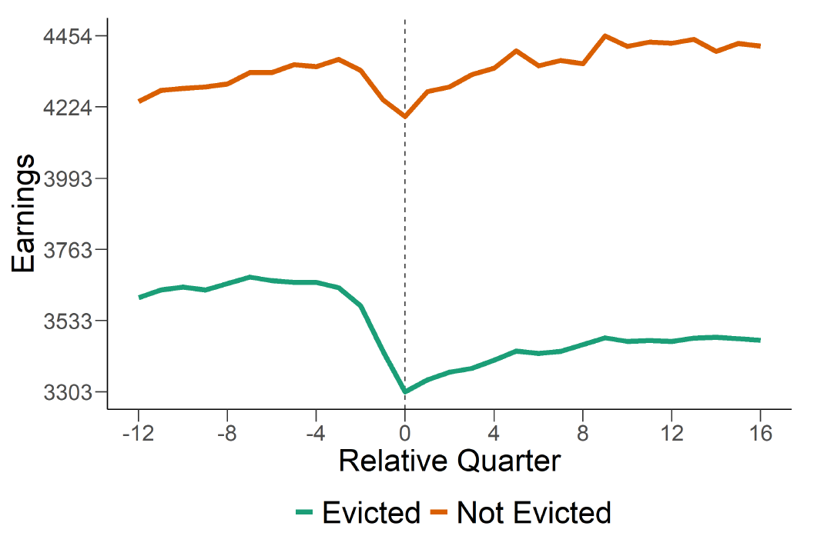
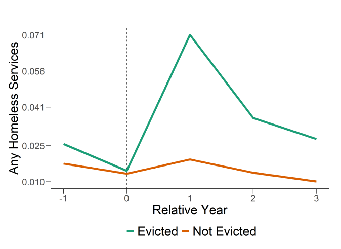

## Research Brief

# Understanding & Measuring the Consequences of Evictions Using Linked Datasets

*Research conducted by Robert Collinson (University of Notre Dame), John Eric Humphries (Yale University), Nick Mader (Chapin Hall), Davin Reed (Federal Reserve Bank of Philadelphia), Daniel Tannenbaum (University of Nebraska - Lincoln), and Winnie van Dijk (Harvard University)*

More than two million U.S. households have an eviction case filed against them each year, and local governments are increasingly pursuing policies to reduce the number of evictions. Measuring the costs of an eviction to tenants and to society is crucial for evaluating these policies and for understanding the role of housing instability as a driver of urban poverty and inequality. This research project relies on extensive data collection and linkages, facilitated by many institutional collaborations, to provide new, rigorous, measures of the impact of an eviction on residential mobility, homelessness, labor market attachment and earnings, financial health, and healthcare use.

### Understanding the impact of eviction on tenants

Our research studies the consequences of eviction for tenants using linked individual-level administrative data from two large cities: Chicago and New York.

First, we use novel longitudinal linked datasets to provide new descriptive facts about the earnings, employment, housing, health, and financial circumstances of tenants in housing court, in the lead-up and aftermath of eviction cases.  

We then study the causal effects of eviction on tenant outcomes. We use an instrumental variable research design which leverages the varying stringency of randomly assigned judges to isolate the effects of eviction from the circumstances which might have led to it.  

### Tenants facing eviction are already experiencing increasing economic distress

We document signs of increasing economic distress in the lead-up to the filing of eviction cases across a broad set of tenant outcomes: falling earnings, decreased attachment to the labor market, rising unpaid bills, and increases in hospital visits.

*Notes:* All results approved for release by the U.S. Census Bureau, authorization number CBDRB-FY20-110.

### Eviction causes spikes in homelessness, reduced earnings, and worsened credit

We find that eviction compounds rising economic distress experienced by tenants by causing subsequent increases in homelessness and housing instability, reductions in earnings, an uptick in hospital visits, and reductions in credit scores and credit access.  Eviction appears particularly harmful for groups who may have additional difficulty navigating the housing market.

>

*Notes:* All results approved for release by the U.S. Census Bureau, authorization number CBDRB-FY20-110.

### Implications

* For many people, the existing safety net is not sufficiently responsive to adverse economic shocks to prevent an ensuing eviction
* Eviction itself can exacerbate adverse circumstances, and for some can even lead to homelessness, suggesting that policies which avert eviction – such as legal aid or temporary financial assistance – may meaningfully reduce economic strain and homelesness
* Rigorous, data-driven evaluation of eviction-related policies is feasible, using a data infrastructure like the one we built for this research project, and is needed to help focus the allocation of funds to where they are most effective
